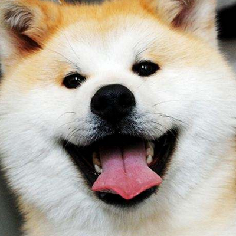

1. 怎么让黄色背景不见，让整只狗狗都充满整个那个400*400的框框呢？
相关代码：
html:

        

            
        

      css:

        .one{
            width: 400px;
            height: 400px;
            margin: 200px;
            overflow: hidden;
            background-color: #678867;
        }
        img{
            transform: rotate(45deg);
        }

解决方法：
使用scale，让狗狗图片变大直至充满整个400*400的空间。

虚线的正方形是我们现在狗狗图片，我们要让这个狗狗图片变成箭头包围的这个框框，设div（也就是实线的方框）为2a，那么扩展之后的图片的一半长度b^2 = a^2+a^2 = 2*a^2; 

        transform: rotate(45deg) scale(1.414);

2. 第一道题的另外一种解决方式（还是有点不是很懂）
使用clip-path，红点可以看成坐标轴原点。（但是我习惯把左下角看为坐标原点）

        img{
            clip-path: polygon(50% 0, 100% 50%, 50% 100%, 0 50% )
        }

3. 怎么把圆角方形和outline之间的间隙给填满？

相关代码：

html:

    

        
    

css:

       .pic{
            background-color: #999999;
            width: 200px;
            height: 100px;
            margin: 100px;
            border-radius: 10px;
            outline: 10px solid #8088C8;
        }

使用box-shadow，给圆角方形加上阴影。
简单回顾一下box-shadow这个属性。
box-shadow: h-shadow v-shadow blur spread color inset;

h-shadow：必填项，表示水平（即X轴）阴影的位置。正值使阴影出现在元素的右边，负值出现在元素的左边。

v-shadow：必填项，表示垂直（即Y轴）阴影的位置。正值使阴影出现在元素的下边，负值出现在元素的上边。

blur： 可选，表示模糊距离。模糊数值越大，尖锐度越小，阴影越朦胧和模糊。负值是不被允许的，并会被处理成0。

spread ：可选，表示阴影的尺寸。可以理解为从元素到阴影的距离。正值会让阴影向各个方向按照指定的数值延伸。负值会让阴影收缩得比元素本身尺寸更小。

color ：可选，表示阴影的颜色。这个不需要我多说了吧，想必大家都会。

inset：可选。将外部阴影 (outset) 改为内部阴影。默认为outset。

a=10px,所以x=4.14;

        .pic{
            background-color: #999999;
            width: 200px;
            height: 100px;
            margin: 100px;
            border-radius: 10px;
            box-shadow: 0 0 0 4.14px  #8088C8;
            outline: 10px solid #8088C8;
        }
得到下面这样子的效果：

当中遇到了一个关于box-shadow的一个小困惑，但是把outline注释掉的时候一切都豁然开朗了。box-shadow不仅仅是加在四个角，而是加在四边的，只不过是其他的都同样颜色的遮盖掉了。

